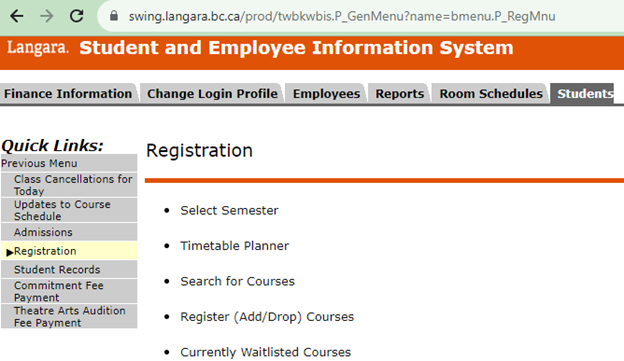
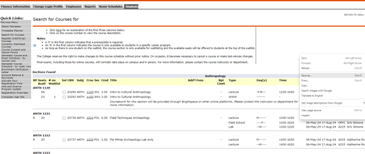

## WebScraper

**Thank you for downloading WebScraper!**

This tool helps you scrape course information from saved HTML pages of your student system and save it as a CSV file for easy access and review.

**Before You Begin:**

Before using WebScraper, you need to prepare your HTML file by following these steps:

1. Log in to the student system using your student account.
2. Navigate to Students --> Registration --> Register(add/drop) Courses.

3. Go to the Course Search section and perform a search to get the list of courses.
4. On the course list page, click on a blank area, then right-click and choose 'Save as' from the context menu.

5. Save the HTML file to a known location on your computer. You will use this file with WebScraper.

**Using WebScraper:**

To use WebScraper, please follow the instructions below:

1. Extract the file from the `WebScraper.zip` archive to a folder on your computer.
2. Find and double-click the `main.exe` file to launch WebScraper.

**Note:** Upon the first run, your system may display a warning indicating that the application is unrecognized. To proceed, click on 'More info' or a similar option in the system popup, and then choose 'Run anyway' or 'Use it anyway'.

3. In the WebScraper interface, click the 'Select HTML File' button and navigate to the location where you saved the HTML file from the student system. Select the file and open it.
4. Once your HTML file is loaded, click the 'Scrape and Save to Excel' button to start the scraping process.
5. After the process completes, you will find the output CSV file in the same folder where `main.exe` is located. The CSV file contains the scraped course information.

**If you encounter any issues or have questions about using WebScraper, please contact the support team (ha3zhang@hotmail.com).**

**Thank you for using WebScraper!**
